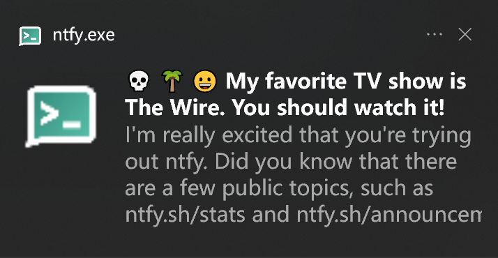

# ntfy Desktop

A simple & easy-to-use desktop client for [ntfy](https://github.com/binwiederhier/ntfy)



By modifying `config.json`, you can subscribe to topics from different servers

```json
{
    "server1": ["topic1", "topic2"],
    "server2": ["topic3"]
}
```