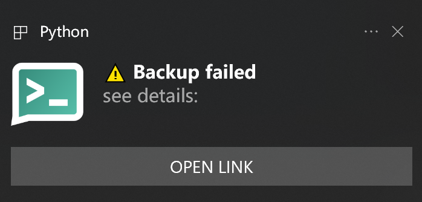

# ntfy Desktop

A simple & easy-to-use desktop client for [ntfy](https://github.com/binwiederhier/ntfy)




By modifying `config.json`, you can subscribe to topics from different servers

```json
{
    "server1": ["topic1", "topic2"],
    "server2": ["topic3"]
}
```

## Features

- [x] Support emoji
- [x] Support click url

## Auto Start on Boot

create a shortcut of `start.bat`

Press `Win+R`, type `shell:startup`, enter

Drag the shortcut you've created into the startup folder